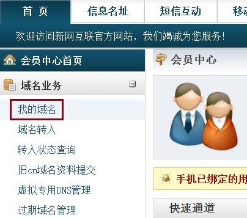

## 新网互联CNAME接入云加速

1. 登陆新网互联网站 www.dns.com.cn;

2. 在页面左侧菜单栏中点击[域名业务] -> [我的域名];

    

3. 在域名列表中点击您将要修改的域名；

4. 在域名管理页面中点击[修改域名DNS];

5. 添加CNAME记录；【同一个子域名若已经存在A记录，请删除A记录以免发生冲突，A记录与CNAME记录实现同样的功能，并不会影响您网站的正常访问】

6. 添加TXT记录，填写云加速分配的TXT记录

