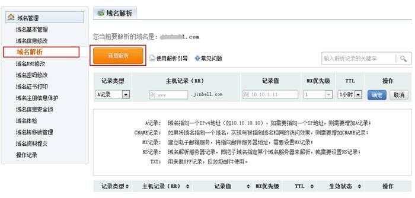
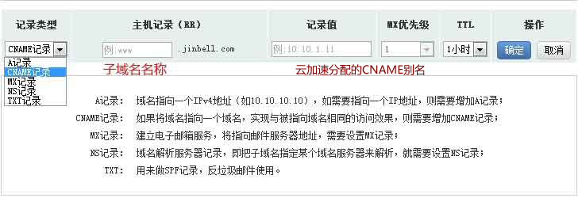
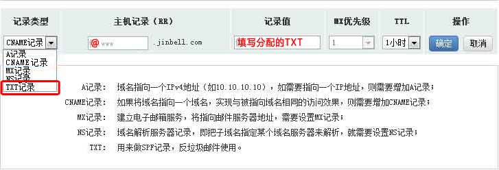

# 万网CNAME接入云加速

1. 登入万网的域名管理页面

2. 点击【域名解析】>>【新增解析】，如图：

3. 在解析中，解析类型选择【CNAME记录】>> 主机记录填写子域名名称 >> 记录值填写百度云加速分配CNAME别名。

    注：不同的子域名云加速分配的CNAME别名是不同的【同一个子域名若已经存在A记录，请删除A记录以免发生冲突】

4. 在解析中，记录类型选择【TXT】 >> 主机记录填写 **@** >> 记录值填写 **分配的TXT**。

