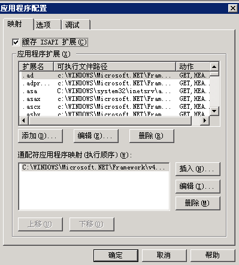
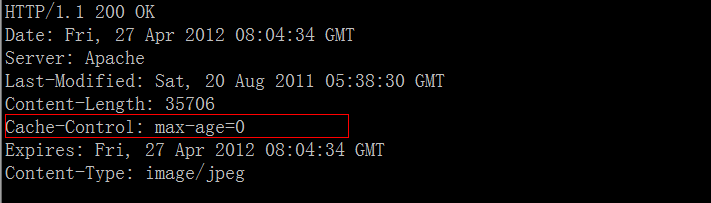

## 过期时间控制


### IIS 缓存策略设置

如果整体的站点只对.html .jpg .png .gif .apk文件，而其他文件都不缓存；可以首先对整个站点设置成不缓存，设置如下：

- 打开“IIS信息管理器”，右键点击服务网站“a.cc.com”的属性，然后选择“HTTP头“选卡，勾选“启用内容过期”，并选择“立即过期”，然后“确定”，具体如下：


    

- 经过上述设置后整个网站的内容都不会被CDN缓存，然后对.html .jpg .png .gif .apk文件类型设置缓存策略;
- 针对特定文件的缓存设置如下：
- 如果上面不同扩展名的文件都单独放在一个特定的目录下面，且该目录没有其他扩展名的文件，那么可以针对这个扩展名所在的整个目录设置缓存的时间；具体方法是在“IIS信息管理器”中，展开网站“a.cc.com”的目录，选中需要设置缓存时间的目录，比如所有jpg都存储在img这个目录下，那么右键点击该目录，选择“属性’，选中”HTTP头“选卡；因为刚才整个网站都设置了不缓存的设置，因此这时打开该目录的”HTTP头“的缓存设置和1中的一致，接下来就有修改这个配置：选择”此时间段后过期“，并且将时间设置为过期的时间值，比如14天，点击“确定”保存，具体如下：

- 为了避免针对特定扩展名的文件进行逐个的配置，我们需要让IIS支持“通配符”，支持“通配符”的配置如下：
- 打开“IIS信息管理器”，右键点击服务网站“a.cc.com”的属性，选择“主目录”选卡，点击选卡上的“配置”按钮，出现如下对话框：


    

- 在“通配符应用程序映射（执行顺序）”一栏下面，点击“插入”按钮，在弹出的文件选择框时选择 C: \WINDOWS\Microsoft.NET\Framework\v4.0.30319\aspnet_isapi.dll 文件，其中“C:”是系统盘，不要勾选“确认文件是否存在”，具体如下：

- 连续两个“确定”按键点击后，就完成了IIS通配符的支持配置
- 接下来就是到存在需要进行缓存配置文件的目录下面，首先选择一个需要缓存扩展名的文件，点击右键，选择属性，选择“HTTP头”选卡，进行2.a）中的配置，并保存；接下来就有对这个文件目录下面所有相同扩展名的文件进行该设置了，此时需要修改IIS的配置文件实现。
- IIS的配置文件放置在C:\WINDOWS\system32\inetsrv\MetaBase.xml（IIS6的设置），用“记事本”程序打开上述文件，如果我们3）中是针对bin目录下面的test.jpg做了缓存过期时间的设置的，那么我们就查找字串“/bin/test.jpg“，就可以在该文件中找到bin目录下test.jpg文件的缓存设置，为了使bin目录下面所有的jpg文件都采用该缓存设置，只需要将“test.jpg”改为”\*.jpg“就可以了，然后保持该文件。注意要修改上述文件，需要在“服务”中关闭“IIS admin Service”。
- 其他扩展名的文件缓存设置可以重复上面的3）和4）操作。

### Nginx 缓存策略设置

HTTP头处理模块（HTTP Headers），这个模块允许设置任意的 HTTP 头

#### add_header
- 语法：`add_header name value`
- 默认值：none
- 使用字段：http, server, location


#### expires
- 语法：`expires [time|epoch|max|off]`
- 默认值：expires off 
- 使用字段：http, server, location
- 这个指令控制是否在应答中标记一个过期时间，如果是，如何标记。
- off 将禁止修改头部中的 Expires和Cache-Control字段。
- Time控制“Cache-Control”的值，负数表示no-cache<
- epoch 将 Expires 头设置为1 January, 1970 00:00:01 GMT。
- max 将Expires头设置为31 December 2037 23:59:59 GMT，将Cache-Control最大化到10 年。


例如设置php的文件类型过期时间设置为1个小时：


设置php的文件类型为no-cache,不让cache服务器缓存：


另外可以通过 `add_header` 设置相对应的缓存策略，对于动态的 php 文件设置为不缓存：
```
location ~ .*\.php$ {
    if ($request_uri !~ ^/dynamicimg/) {
        add_header              Cache-Control "no-cache";
        add_header              Pragma no-cache;
    }
}
```

### Apache 缓存策略设置

Apache 的过期策略可以通过 apache 的 `mod_expires` 和 `mod_headers` 两个模块设置：

#### 模块 mod_expires 设置:
- 允许通过配置文件控制HTTP的"Expires"和"Cache-Control"头内容
- mod_expires 模块的主要作用是自动生成页面头部信息中的 Expires 标签和 Cache-Control 标签，从而降低客户端的访问频率和次数，达到减少不必要流量和增加访问速度的目的
- mod_expires 是 apache 众多模块中配置比较简单的一个，它一共只有三条指令
- ExpiresActive 指令：打开或关闭产生”Expires:”和”Cache-Control:”头的功能。
- ExpiresByType 指令：指定MIME类型的文档（例如：text/html）的过期时间。
- ExpiresDefault 指令：默认所有文档的过期时间。


#### 过期时间的写法
- “access plus 1 month”
- “access plus 4 weeks”
- “now plus 30 days”
- “modification plus 5 hours 3 minutes”
- A2592000
- M604800


#### 配置实例：
- ExpiresActive On（开启mod_expires功能）
- ExpiresDefault "access plus 6 months"（默认的过期时间是6个月）
- ExpiresByType image/\* "access plus 10 years"（图片的文件类型缓存时间为10年）
- ExpiresByType text/\* "access plus 10 years"（文本类型缓存时间为10年）
- ExpiresByType application/\* "access plus 30 minutes"（application文件类型缓存30分钟）


#### 验证：image/jpeg 缓存时间为 315360000s（10 年）


如果将image/jpeg设置为不缓存（将max-age设置为0s）：
```
#   ExpiresByType image/\* "access plus 10 years"
ExpiresByType image/*  A0
```

