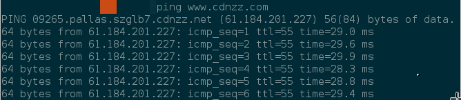

## 判断域名是否已经使用速致云

已经在速致云 CDN 产品控制台完成域名配置，并完成域名 CNAME 解析的网站，可以通过以下方法判断是否已经使用到速致云 CDN 提供的服务。

- 系统命令行 ping 对应域名，如下图所示，如果在 ping 的结果中看到 `cdnzz.net` 的别名，则表示域名解析到了速致云 CDN，正在使用速致云 CDN 提供的服务，否则没有在使用速致云 CDN
- 如果没有成功解析到 CDN 域名，有可能域名解析配置错误或者解析还未生效，建议用户到域名解析提供商处进行检查

