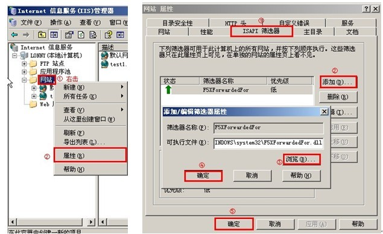

## 网站日志中获取访问用户的原始 IP

### Nginx 环境
``'$http_x_forwarded_for - $remote_user [$time_local] "$request" '$status $body_bytes_sent "$http_referer" ''"$http_user_agent" ';``


### Apache 环境
``LogFormat "%{X-Forwarded-For}i %l %u %t \"%r\" %>s %b \"%{Referer}i\" \"%{User-Agent}i\""``

### IIS 环境
- 为了能让IIS Web服务器记录客户访问的真实IP地址，我们需要为IIS Web服务器的ISAPI加入一个名为“F5XForwardedFor”的扩展
- 下载 “F5XForwardedFor.dll” 库文件；[点击这里](http://cdndata.oss-cn-hangzhou.aliyuncs.com/F5XForwardedFor2008.zip?spm=5176.775973844.2.3.q1vzZw&file=F5XForwardedFor2008.zip)
- 根据您服务器的版本选择对应的库文件，如果您的Web服务器是32位系统，则选择X86的库文件，如果是64位操作系统则选择X64对应库文件；
- 将下载下来的“F5XForwardedFor.dll”文件复制到“C:\Windows\System32\”目录中
- 配置IIS，在ISAPI中加入“F5XForwardedFor.dll”扩展。



在“C:\Windows\System32\”目录中新建一个名为“F5XForwardedFor.ini”的文件，代码如下：
```
[SETTINGS]
HEADER=X-Forwarded-For
```
