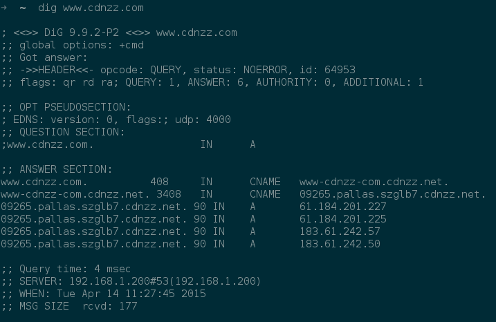
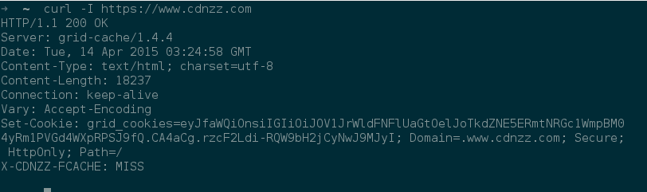
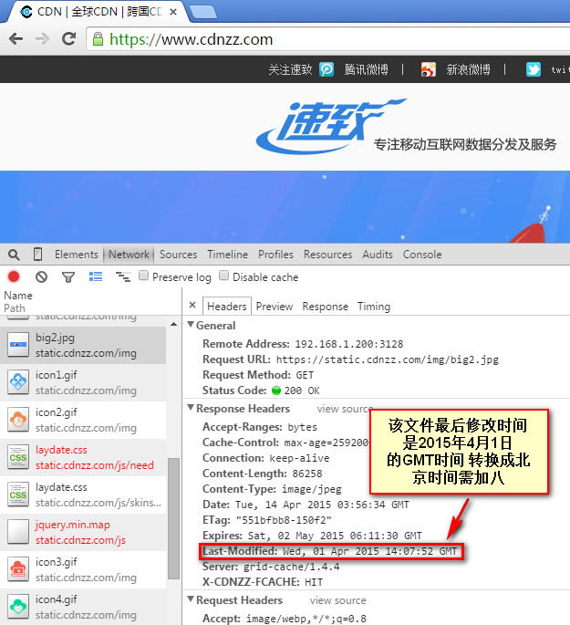

## 源站状态检测

### 加速域名 CNAME 切换状态检查

检查可以使用linux下的 `dig` 命令或者使用 dos 下的 `nslookup`

### 源站访问状态检测

网站访问出错，可以固定访问下源站，看下源站响应是否ok，可以采用linux下的命令行方式或者是通过固定hosts，在浏览器中访问，推荐您使用chrome，使用chrome自带的开发者工具（Ctrl+Alt+i），查看对应的http请求头和响应头：

#### 请求头

#### 响应头

