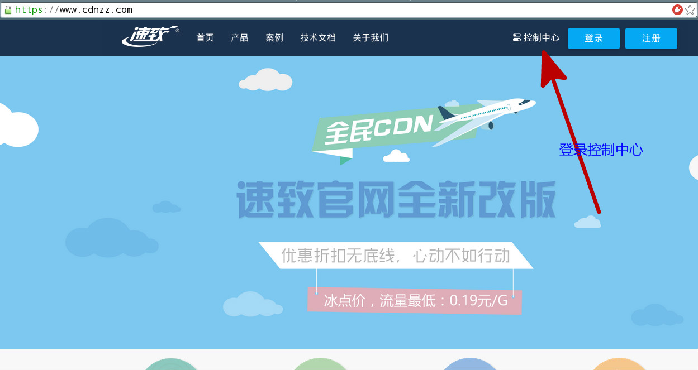
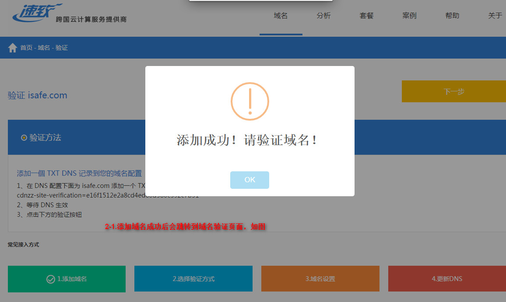
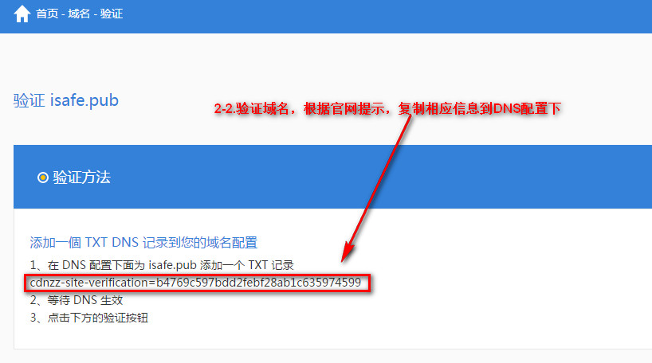
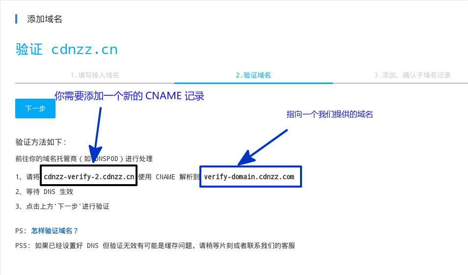
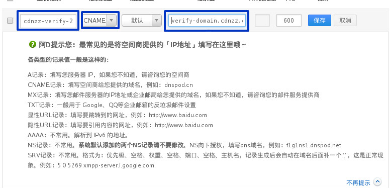
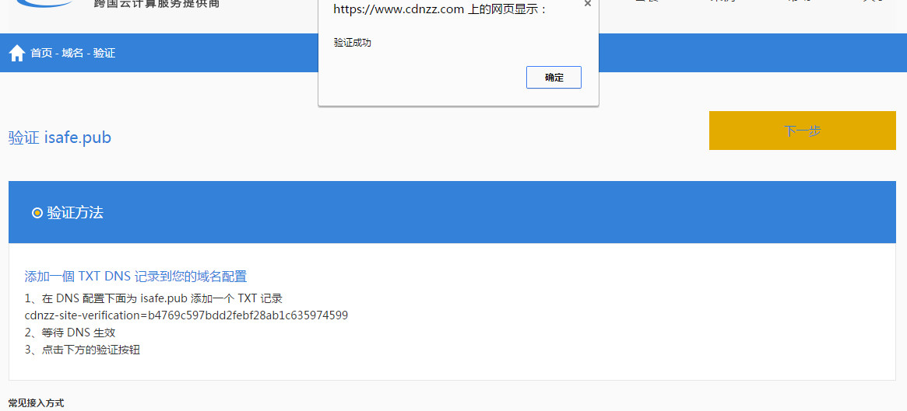

## 添加域名

### 添加域名

注册成功后，您可以自由添加或删除域名。若您还未注册我们帐号，请点击 [注册链接](https://www.cdnzz.com/personal/sign-up) 进行注册

### 验证域名

我们需要验证域名是否属于你，目前使用的是 DNS TXT 的验证方法

### 修改 DNS 记录

在域名“解析设置”处新增一条 TXT 记录，其它常见域名托管商的也是类似的

添加成功后 TXT 记录类似下图

### 确认域名验证

