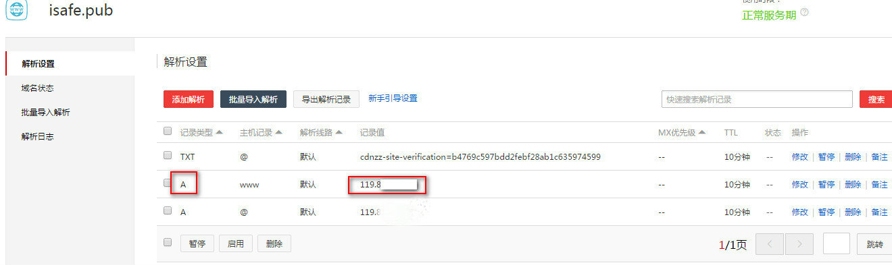

## 添加子域名

1. 成功添加域名后，可进行子域名添加;在域名列表处点击“子域名设置”
    

2. 点击 “添加记录” 进行子域名添加
    

3. 输入相应记录值之后点击 “确认” 按钮进行添加
    
    

4. 添加别名记录

    在添加了记录值之后，我们会生成一个 CNAME 给您，然后需要您去域名托管的地方修改响应的记录
    
    **同一个子域名若已经存在A记录，请删除A记录以免发生冲突，A记录与CNAME记录实现同样的功能，并不会影响您网站的正常访问**
    
    

[如何得知是否在使用我们的服务？]()

