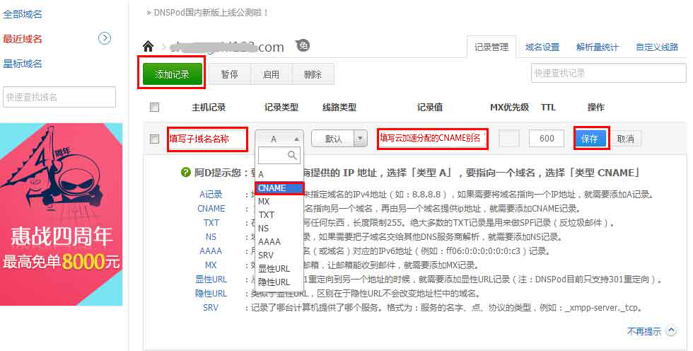
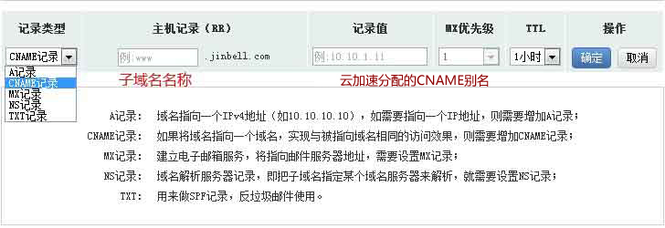
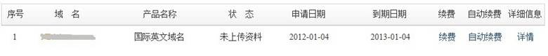
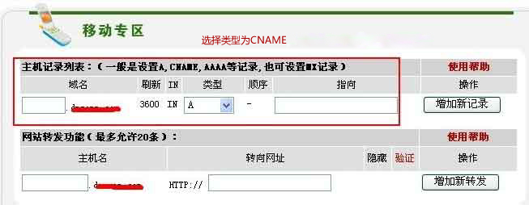

# 域名接入（验证/指向）
------------

提供国内若干主流 DNS 托管商的接入方式说明。

## DNSPOD 接入

1. 登入dnspod的域名管理页面

2. 点击【我的域名】>>点击需要解析的域名，如图

3. 在解析中，记录类型选择【CNAME】>>主机记录填写 **子域名名称** >> 记录值填写云加速 **分配CNAME别名**。注：不同的子域名云加速分配的CNAME别名是不同的【同一个子域名若已经存在A记录，请删除A记录以免发生冲突】

------------
## 万网接入

1. 登入万网的域名管理页面

2. 点击【域名解析】>>【新增解析】，如图：

3. 在解析中，解析类型选择【CNAME记录】>> 主机记录填写子域名名称 >> 记录值填写百度云加速分配CNAME别名。

    注：不同的子域名云加速分配的CNAME别名是不同的【同一个子域名若已经存在A记录，请删除A记录以免发生冲突】

------------
## 新网接入

1. 登录新网域名DIY自助管理面板dcp.xinnet.com

2. 选择 "域名管理"

    

3. 添加别名记录【同一个子域名若已经存在A记录，请删除A记录以免发生冲突，A记录与CNAME记录实现同样的功能，并不会影响您网站的正常访问】

## 新网互联接入

1. 登陆新网互联网站 www.dns.com.cn;

2. 在页面左侧菜单栏中点击[域名业务] -> [我的域名];

    

3. 在域名列表中点击您将要修改的域名；

4. 在域名管理页面中点击[修改域名DNS];

5. 添加CNAME记录；【同一个子域名若已经存在A记录，请删除A记录以免发生冲突，A记录与CNAME记录实现同样的功能，并不会影响您网站的正常访问】

