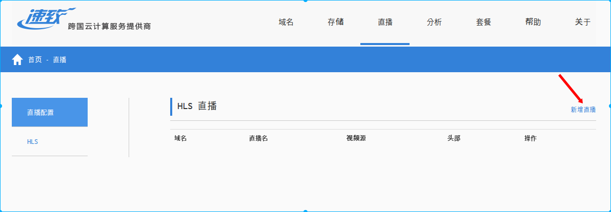
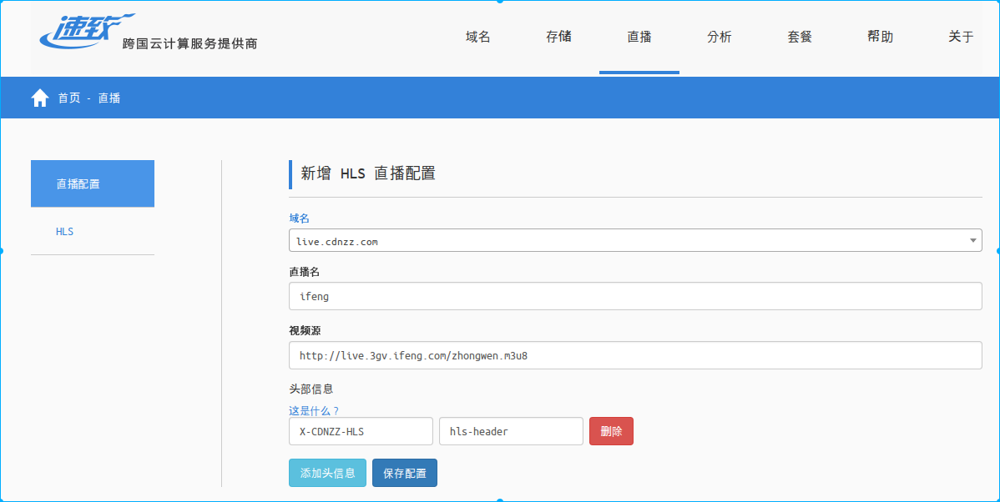
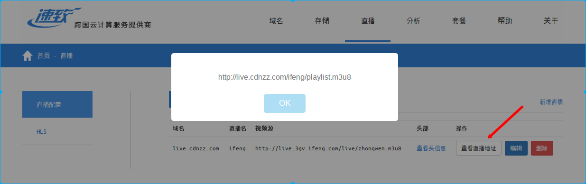
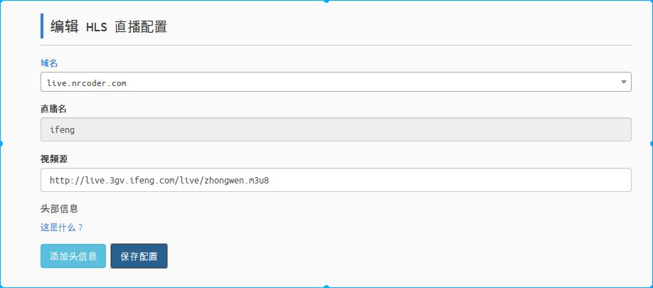

## HLS 直播分发

### 介绍
使用我们的 CDN　云分发系统进行 HLS 直播流分发，帮助客户使用极少的直播源带宽支撑针对海量用户的直播，同时大幅提升直播的流畅度．此外，我们也可对第三方的直播源进行分发, 得益于我们遍布全球的 CDN 节点分布, 跨运营商或海外直播源亦可流畅抓取．

### 接入

1. 新增直播流
    进入直播产品页后点击 [新增直播] 进入直播添加页面, 如下:
    
    

    **注意**
    > 直播用的域名需要先到域名产品页添加

2. 得到直播地址
    直播添加完成后会在页面显示, 点击 [查看直播地址] 即可得到已接入 CDN 的直播地址, 如下:
    

### 更新直播参数
系统支持对已添加的直播更新直播源和 HTTP 头, 当直播源发生变化时可及时更新, 点击 [编辑] 即可进入更新页, 如下:

### 删除
不需要的直播点击 [删除] 按钮即可删除
