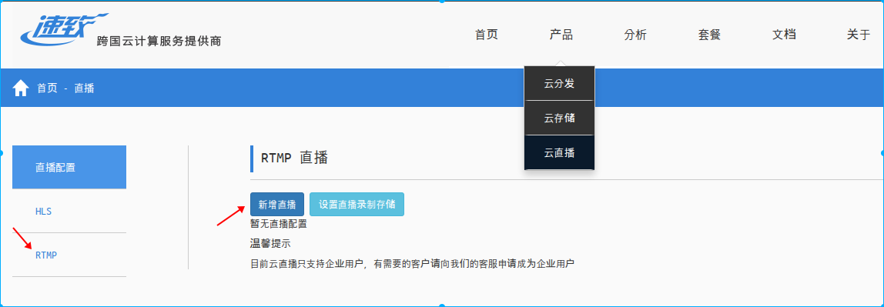
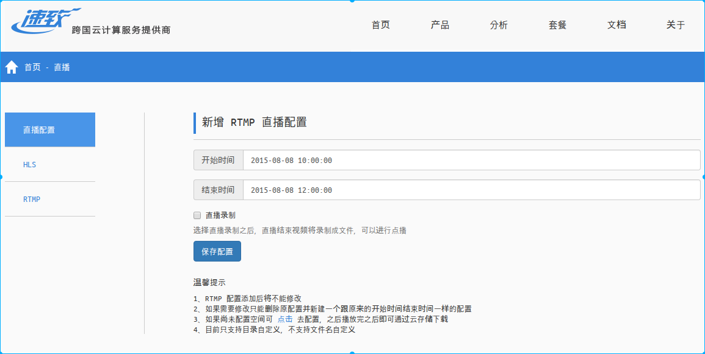
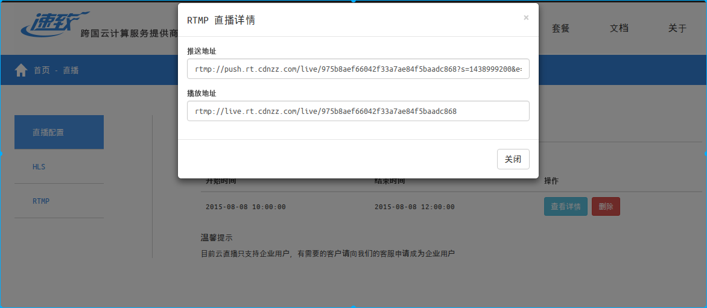
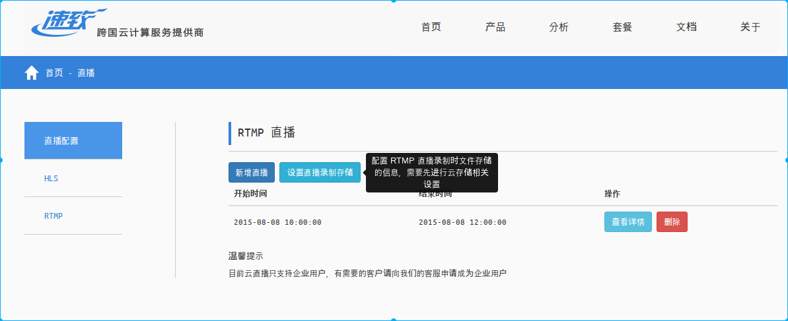
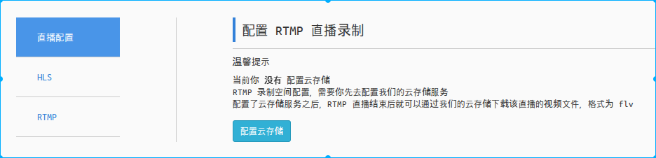
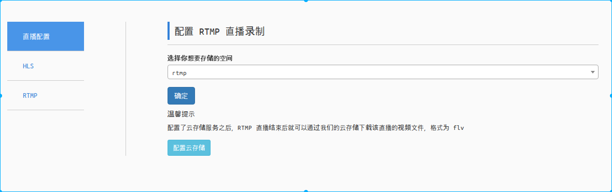
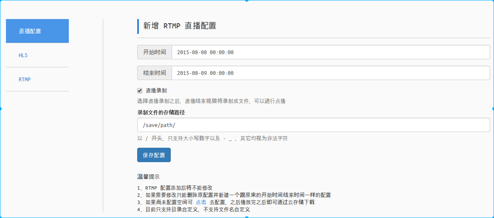

## RTMP 直播分发
#### 简介
借助我们遍布全球、多运营商的服务节点为您提供快速、稳定的 RTMP 直播分发服务。同时也提供基于我们云存储的直播录制服务。

#### 接入流程
1. 到我们的直播平台新增直播，得到对应的“推送地址”和“播放地址”
2. 推送 RTMP 流到“推送地址”
3. 使用“播放地址”观看直播
4. 同时可以配置是否录制直播流

#### 操作演示
##### 新增直播    
登录后点击 [产品] -> [云直播]，再点击左侧 [RTMP] 进入 RTMP 直播管理，点击 [新增直播] 添加新的直播流，如下:

新增直播流只需要选择直播的时间段即可，如果需要进行直播录制可进一步设置，[保存配置] 后即可生成新的直播流地址，如下:    

##### 查看直播流
直播添加成功后会在 RTMP 直播管理页列出，点击 [查看详情] 可查看“推送地址”和“播放地址”，如下:    

##### 配置直播录制
1. 进入 RTMP 直播管理页后点击 [设置直播录制]，进入直播录制配置页面，如下:

2. 如果未添加过云存储则需要先前往云存储管理页进行添加，点击 [配置云存储] 即可跳转，如下:

若已存在云存储则选择一个存储空间作为直播录制存储后 [确定] 即可，如下:

3. 在新增直播时选择 [直播录制] 并设置存储路径即可启用录制功能, 录制的视频会保存到已设置的直播录制存储中，如下:

