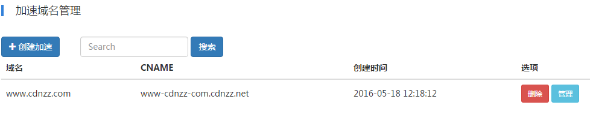

## RTMP 直播分发
#### 简介
视频直播服务（LiveVideo）是基于领先的内容接入与分发网络和大规模分布式实时转码技术打造的音视频直播平台，提供便捷接入、高清流畅、低延迟、高并发的音视频直播服务。借助我们遍布全球、多运营商的服务节点为您提供快速、稳定的 RTMP 直播分发服务。同时也提供基于我们云存储的直播录制服务。

视频直播服务提供Web管理控制台、API和软件开发工具包。您可以通过它们使用、管理视频直播服务，也可以与您自己的应用和服务集成。
所有服务按使用付费，服务能力自动伸缩，告别复杂的架构设计和编程开发，维护成本几近于零，使您可以专注于业务逻辑实现及最终用户体验的提升。

#### 产品优势
##### 易接入
按规则获得推流、播放地址，极简开发；

##### 高流畅
业内领先的播放流畅率，更佳观看体验；

##### 高并发
1000万+ 并发能力，500+ 就近接入节点；

##### 高安全
支持推流黑名单，灵活防盗链；

#### 接入流程
1. 到我们的直播加速管理新增直播加速域名
2. 在加速域名的管理界面，得到对应的“推送地址”和“播放地址”
2. 推送 RTMP 流到“推送地址”
3. 使用“播放地址”观看直播
4. 同时可以配置是否录制直播流

#### 快速入门
##### 1.登录速致官网
访问速致官网，点击左上角“登录”，进入速致云服务管理控制台。
##### 2.进入加速域名管理控制台
点击云直播菜单进入直播加速域名管理控制台。

##### 3.添加直播加速域名
点击“创建加速”按钮弹出创建加速对话框：

如果在下拉列表中没有可选项，则请先至【云分发】-【管理域名】中添加域名，请参考“添加域名”文档。

##### 4.获取推流和播放地址
在加速域名管理中，点击列表中的域名的“管理”按钮进入管理详情界面。

##### 5.推流说明
推流地址：

rtmp://push.rt.cdnzz.com/app?vhost=test.cdnzz.com/stream
	
说明：

apush.rt.cdnzz.com是直播中心服务器.

app是频道名称，支持自定义，可以更改.

stream是流名称，支持自定义，可以更改.

vhost参数是最终在边缘节点播放的域名，即你的直播加速域名.

OBS 推流地址设置注意事项：

在OBS 设置 - 广播设定中应按下图设置：

以上面的推流地址为例，参数设置为：

FMS URL： rtmp://push.rt.cdnzz.com/live?vhost=kgimg-com.cdnzz.com

播放路径/串码流（如果存在）: streamname

如您开启了鉴权，则鉴权参数也一并放在FMS URL后面。播放路径/串码流中只填写流名称。

##### 6.播放说明
支持三种方式播放：

RTMP	  rtmp://test.cdnzz.com/appname/streamname

FLV	  http://test.cdnzz.com/appname/streamname.flv

M3U8	  http://test.cdnzz.com/appname/streamname_playlist.m3u8

test.cdnzz.com为用户的加速域名。

##### 7.鉴权说明
直播流媒体的推送和播放采用同一套鉴权方案，可以在控制台的鉴权配置中进行配置。

在云直播 - 加速域名管理 - 加速域名管理详情页 - 鉴权管理 设置鉴权配置如下：

开启鉴权后，可以点击“修改”按钮进入设置令牌和令牌失效时间。

鉴权url计算器：
用户填写上频道名和流名，鉴权计算器可按照配置的播放或推流的令牌生成鉴权url，用户可直接拷贝过去播放或推流用。

