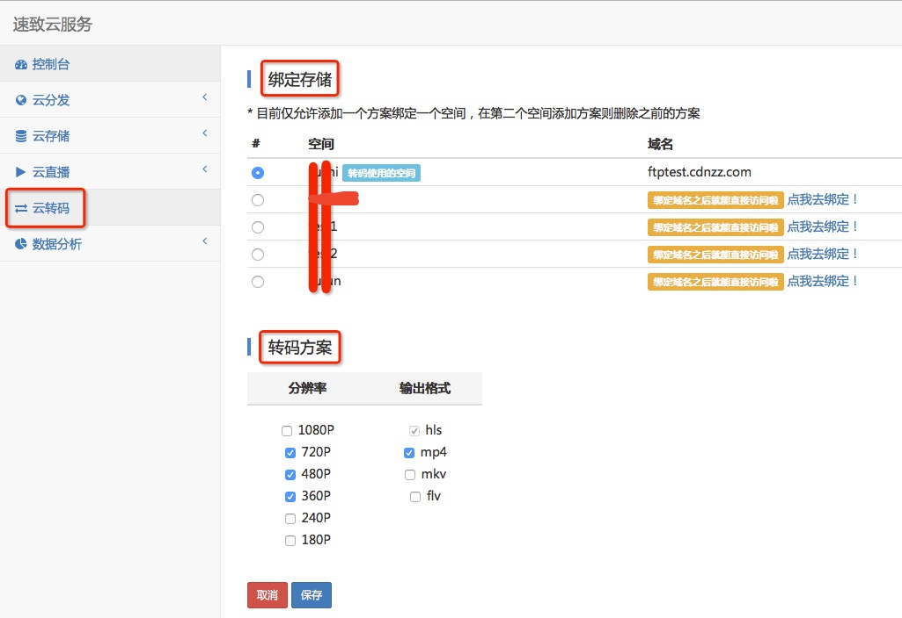

## 云转码处理

### Quick Start

登陆控制中心，选择“云转码”选项。

首先需要绑定相关存储空间，如果还没有开通需要去“云存储”页面进行开通然后再绑定权限。当绑定成功后，表示后面上传的视频文件以及转码后文件都会在该存储空间上面存放和获取（通过 CDN）。

然后需要选择“转码方案”，指定希望进行转码的分辨率以及输出格式，其中 HLS 为必选。转码方案用于指定处理服务对用户上传视频的处理机制。

最后，可使用 [API](../dev/avapi/) 来上传视频文件，通过指定上传的媒体文件的输出路径以及用户标示即可创建转码作业。

### 相关方案

当客户选择了 [720P, 480P, 360P] 分辨率，以及 [HLS, MP4] 输出格式的转码方案。

第一种情况，那么当客户通过 API 上传一个名为 suzhi-1080p.mp4 的 1080P 媒体文件，我们的转码集群会对这个文件进行 720P, 480P, 360P 的转码，并且都包含 HLS 和 MP4 格式的文件，即一个输入文件进行六个文件的转码处理输出。包括：

- (input) suzhi-1080p.mp4
- (output) suzhi-1080p-720p.mp4
- (output) suzhi-1080p-480p.mp4
- (output) suzhi-1080p-360p.mp4
- (output) suzhi-1080p.m3u8
- (output) suzhi-1080p/720.m3u8
- (output) suzhi-1080p/480.m3u8
- (output) suzhi-1080p/360.m3u8
- (output) suzhi-1080p/orig.m3u8

注意，上面的 suzhi-1080p.m3u8 包含了 HLS 中对 [720P, 480P, 360P] 的多码率自适应处理。用户转码成功后，若需要访问 HLS 数据，入口应该就是这个 m3u8 文件。其中 suzhi-1080p/orig.m3u8 为原生视频文件的 HLS 访问入口。

第二种情况，如果客户通过 API 上传一个名为 suzhi-480p.mp4 的 480P 媒体文件，我们的转码集群会对这个文件进行 480P, 360P 的转码，并且都包含 HLS 和 MP4 格式的文件，即一个输入文件进行四个文件的转码处理输出。包括：

- (input) suzhi-480p.mp4
- (output) suzhi-480p-480p.mp4
- (output) suzhi-480p-360p.mp4
- (output) suzhi-480p.m3u8
- (output) suzhi-480p/480.m3u8
- (output) suzhi-480p/360.m3u8
- (output) suzhi-480p/orig.m3u8

注意，虽然客户上传的是 480P 的媒体文件，速致的转码处理还是会对 480p 的文件进行转码处理。

第三种情况，如果客户通过 API 上传一个名为 suzhi-240p.mp4 的 240P 媒体文件，因为转码方案里面最小的指定就是 360P，故我们的转码集群不会对这个文件进行转码，即一个输入文件没有包含转码的输出。输出文件包括：

- (input) suzhi-240p.mp4
- (output) suzhi-240p.m3u8
- (output) suzhi-240p/orig.m3u8

注意，这种情况下，上面的 suzhi-240p.m3u8 会包含原生视频文件的 HLS 切片数据，即 suzhi-240p/orig.m3u8。

## FAQ

### 常见问题

* 什么是云转码服务？

云转码服务，是为多媒体数据提供的转码计算服务。它以经济、弹性和高可扩展的音视频转换方法，将多媒体数据转码成适合在PC、TV 以及移动终端上播放的格式。

* 云转码有什么用处？

您可以使用速致云转码处理将不同媒体格式的文件以不同的分辨率、比特率和帧速转换成 FLV/TS(M3U8)/MP4 文件；您也可以用它创建截图、添加水印等。

* 如何开始使用速致云转码服务？

请看上面的 [Quick Start](../user-guide/transcode/#_1)。

* 速致云转码服务如何收费？

用户只需为使用的资源付费，实时结算。服务单价由转码输出的编码格式、分辨率以及转码资源类型决定，并按输出媒体的时长计费。另外，对API按调用次数收费，详情请见 [价格总览](https://www.cdnzz.com/activity-package)。

* 是否可以使用内容分发网络 (CDN) 来分发媒体文件？

默认绑定的存储空间内容即通过速致的 CDN 来进行分发数据。

* 一个转码作业需要多长时间？

许多因素会影响转码速度，例如输入文件的时长、分辨率以及比特率、转码模版设置等。如果收到大量作业，它们将被排序处理。

* 能否为一个作业创建多个输出？

每一个转码作业都对应一个输入文件、一个转码模版和一个转码输出文件。速致云转码支持一次提交多个输出，系统会为每个输出创建一个作业。

* 可以同时处理几个作业？

每个用户都有默认的转码资源限制，转码资源分配给管道使用，各管道相互独立。每个管道同时处理的作业数量最多不超过分配给该管道资源限额。

* 为什么我的作业一直失败？

作业失败有多种原因，请留意返回错误信息。如果您收到预处理失败的错误，说明我们无法解码您的源文件，且我们希望您通过工单等渠道告知我们详细信息。我们需要以下信息来协助诊断：速致账户ID、作业ID。
